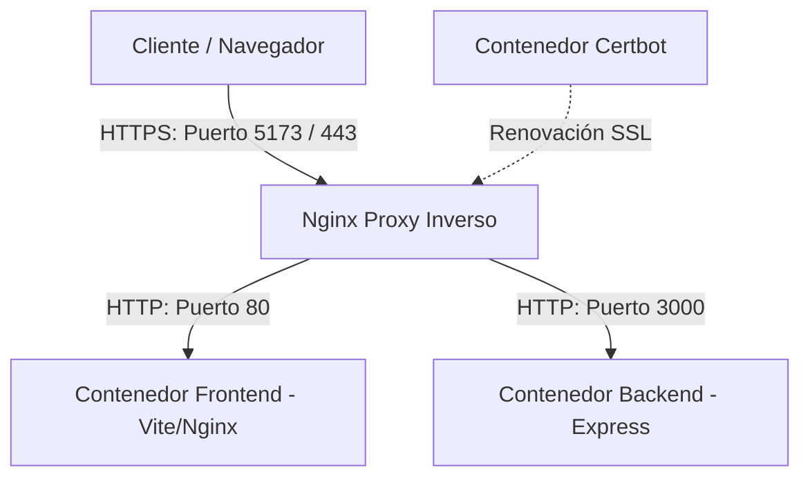

# Documentación de Despliegue y Seguridad SSL (Vite + Express + Nginx + Docker)

Este documento detalla la arquitectura, configuración y procedimientos implementados para el despliegue y la seguridad de la plataforma web **Finix**, tanto en el entorno de desarrollo local como en un entorno de producción.

---

## 1. Resumen de la Arquitectura de Despliegue
La aplicación utiliza una arquitectura de **microservicios dockerizados** donde un proxy inverso Nginx actúa como puerta de enlace única, gestionando los certificados SSL y redirigiendo el tráfico según la ruta:

*   **Frontend (`frontend`):** Aplicación de una sola página (SPA) en React + Vite compilada y servida a través de Nginx interno en el puerto `80`.
*   **Backend (`backend`):** API REST en Node.js + Express escuchando en el puerto `3000`.
*   **Proxy Inverso (`nginx`):** Servidor Nginx principal que expone los puertos `80` (HTTP) y `443`/`5173` (HTTPS) al exterior. Se encarga de la encriptación SSL y redirige `/api` al backend y `/` al frontend.
*   **Gestor de Certificados (`certbot`):** Cliente de Let's Encrypt para generar y renovar automáticamente certificados SSL mediante desafíos ACME.



---

## 2. Entorno de Desarrollo Local (Con Candado SSL de Confianza)
Para cumplir con los requisitos de desarrollo seguro sin necesidad de servidores externos ni dominios públicos, configuramos un entorno SSL local utilizando la herramienta **`mkcert`**.

### ¿Cómo funciona?
1. **Entidad de Certificación Local (CA):** `mkcert` genera una Autoridad de Certificación en la computadora local. Al instalarla, el sistema operativo y el navegador confían automáticamente en cualquier certificado firmado por ella.
2. **Generación de Certificados:** Se creó un par de claves seguras para el dominio `localhost`:
   *   `nginx-selfsigned.crt` (Certificado)
   *   `nginx-selfsigned.key` (Llave privada)
3. **Integración con Vite:** Modificamos [vite.config.js](file:///c:/Users/exsem/Documents/9%20Cuatrimestre/Finix/finix-frontend/vite.config.js) para habilitar el protocolo HTTPS nativo durante el desarrollo local:
   ```javascript
   server: {
     host: true,
     https: {
       key: fs.readFileSync(resolve(__dirname, '../certbot/conf/nginx-selfsigned.key')),
       cert: fs.readFileSync(resolve(__dirname, '../certbot/conf/nginx-selfsigned.crt')),
     }
   }
   ```
4. **Resultado:** Al ejecutar `npm run dev`, el servidor local se levanta automáticamente en **`https://localhost:5173`** mostrando el candado verde de conexión segura.

---

## 3. Configuración de Archivos del Entorno Docker

### A. Orquestador: [docker-compose.yml](file:///c:/Users/exsem/Documents/9%20Cuatrimestre/Finix/docker-compose.yml)
Define la interconexión de contenedores y el mapeo de puertos:
```yaml
services:
  frontend:
    build:
      context: ./finix-frontend
      dockerfile: Dockerfile
    restart: always

  backend:
    build:
      context: ./backend
      dockerfile: Dockerfile
    restart: always
    environment:
      - PORT=3000

  nginx:
    image: nginx:alpine
    ports:
      - "80:80"
      - "5173:443" # Mapea el puerto local 5173 a HTTPS (443) de Nginx
    volumes:
      - ./nginx/default.conf:/etc/nginx/conf.d/default.conf:ro
      - ./certbot/conf:/etc/letsencrypt:ro
      - ./certbot/www:/var/www/certbot:ro
    depends_on:
      - frontend
      - backend
    restart: always

  certbot:
    image: certbot/certbot
    volumes:
      - ./certbot/conf:/etc/letsencrypt
      - ./certbot/www:/var/www/certbot
    entrypoint: "/bin/sh -c 'trap exit TERM; while :; do certbot renew; sleep 12h & wait $${!}; done'"
```

### B. Servidor Proxy: [nginx/default.conf](file:///c:/Users/exsem/Documents/9%20Cuatrimestre/Finix/nginx/default.conf)
Administra la redirección de tráfico y la autenticación SSL:
```nginx
# Redirección de HTTP a HTTPS
server {
    listen 80;
    server_name localhost;
    return 301 https://$host$request_uri;
}

# Servidor HTTPS seguro
server {
    listen 443 ssl;
    server_name localhost;

    ssl_certificate /etc/letsencrypt/nginx-selfsigned.crt;
    ssl_certificate_key /etc/letsencrypt/nginx-selfsigned.key;

    ssl_protocols TLSv1.2 TLSv1.3;
    ssl_prefer_server_ciphers on;

    # Backend API Proxy
    location /api {
        proxy_pass http://backend:3000;
        proxy_http_version 1.1;
        proxy_set_header Upgrade $http_upgrade;
        proxy_set_header Connection "upgrade";
        proxy_set_header Host $host;
        proxy_cache_bypass $http_upgrade;
    }

    # Frontend SPA Proxy
    location / {
        proxy_pass http://frontend:80;
        proxy_http_version 1.1;
        proxy_set_header Upgrade $http_upgrade;
        proxy_set_header Connection "upgrade";
        proxy_set_header Host $host;
        proxy_cache_bypass $http_upgrade;
    }
}
```

---

## 4. Despliegue en Producción (Paso a Paso - 100% Gratis)

Para desplegar esta configuración en un servidor real en internet de forma gratuita, el equipo puede seguir estos pasos utilizando proveedores sin costo:

### Paso 1: Dominio Gratis (DuckDNS)
1. Iniciar sesión en [DuckDNS.org](https://www.duckdns.org/).
2. Crear un subdominio (ej: `finix-proyecto.duckdns.org`).

### Paso 2: Servidor VPS Gratis (Oracle Cloud)
1. Registrarse en la capa gratuita de **Oracle Cloud (Always Free Tier)**.
2. Crear una máquina virtual con **Ubuntu Server** y anotar su IP pública.
3. Actualizar la IP pública en el panel de **DuckDNS**.
4. Abrir los puertos **80 (HTTP)** y **443 (HTTPS)** en las reglas de entrada de la consola de red de Oracle y en el firewall interno de la VM:
   ```bash
   sudo ufw allow 80/tcp
   sudo ufw allow 443/tcp
   sudo ufw reload
   ```

### Paso 3: Obtención de Certificado SSL de Producción (Certbot)
1. Conectarse al VPS e instalar Docker.
2. En el archivo `nginx/default.conf`, cambiar `server_name localhost;` por tu dominio de DuckDNS (ej: `server_name finix-proyecto.duckdns.org;`).
3. Levantar los servicios básicos:
   ```bash
   docker compose up -d --build frontend backend nginx
   ```
4. Solicitar el certificado SSL oficial (gratuito) firmado por Let's Encrypt:
   ```bash
   docker compose run --rm certbot certonly --webroot --webroot-path=/var/www/certbot --email tu-correo@gmail.com --agree-tos --no-eff-email -d finix-proyecto.duckdns.org
   ```
5. Actualizar el archivo `nginx/default.conf` para cambiar las rutas de los certificados apuntando a los reales de producción:
   ```nginx
   ssl_certificate /etc/letsencrypt/live/finix-proyecto.duckdns.org/fullchain.pem;
   ssl_certificate_key /etc/letsencrypt/live/finix-proyecto.duckdns.org/privkey.pem;
   ```
6. Reiniciar todo para activar la conexión encriptada de producción:
   ```bash
   docker compose down && docker compose up -d
   ```

---

## 5. Comandos de Utilidad para el Equipo

| Comando | Descripción |
| :--- | :--- |
| `docker compose up -d --build` | Compila y arranca todos los contenedores en segundo plano. |
| `docker compose down` | Detiene y remueve todos los contenedores y redes virtuales. |
| `docker compose ps` | Muestra el estado actual y los puertos de los contenedores activos. |
| `docker compose logs [servicio] --tail 50 -f` | Monitorea en tiempo real los logs de un servicio (ej: `nginx` o `frontend`). |
| `docker compose restart nginx` | Reinicia únicamente el servidor de Nginx (útil para limpiar caché de red). |
